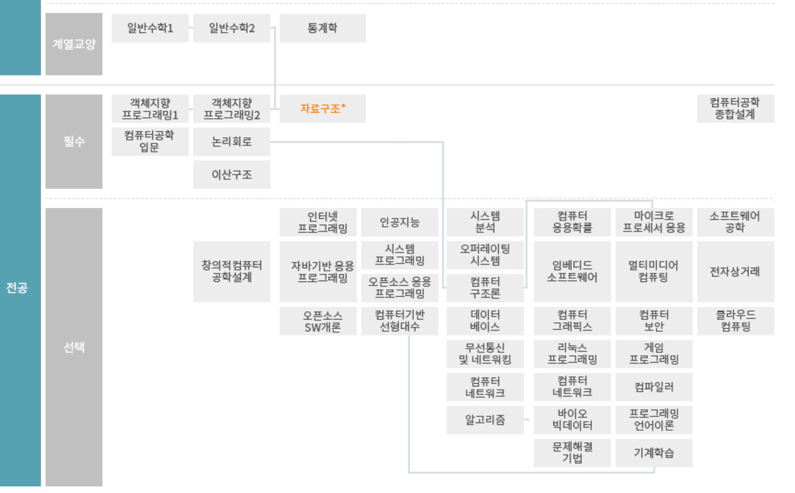

# 위상 정렬 (Topology Sort)

> 순서가 정해져 있는 작업을 차례로 수행해야 할 때 그 순서를 결정하기 위해 사용하는 알고리즘

## 위상 정렬의 예시

- 해당 사진은 실제 인하대 컴퓨터 공학과의 이수체계도이다.
- 자료구조를 배우기위해서는 일반수학 1,2와 객체지향 프로그래밍 1,2를 모두 수강해야한다.
- 나와있지 않지만 자료구조를 배우면 이후 문제해결기법이나 알고리즘을 수강할 수 있다.
- 해당 이수체계도는 `위상 정렬`로 파악이 가능하다.

## 위상 정렬의 조건
- 위상 정렬은 `DAG(Directed Acylic Graph`에서 적용가능하다.
- ***사이클이 발생시 위상 정렬을 수행할 수 없다***
    - 왜냐하면, 위상 정렬은 시작점이 존재해야 하는데 사이클 그래프에선 어디가 시작점인지 찾을 수 없기 때문이다.

## 위상 정렬의 특징
- 현재 그래프가 위상 정렬이 가능한가? ***즉, DAG인가?***
- 위상 정렬이 가능하다면 그 결과가 무엇인가?
- 기본적인 구현으로는 스택(Stack)을 이용한 방식이고, 다른 하나는 큐(Queue)를 이용한 방식이 있다.
    - 해당 문서에서는 `Queue`를 기반으로 해당 알고리즘의 설명을 이어나가겠다.

## 위상 정렬 알고리즘 작동 방식
1. 각노드의 진입차수를 계산한다.
2. 진입 차수가 0인 정점을 큐에 삽입한다.
   - `진입 차수(In-degree)`?: 특정 노드로 들어오는 간선의 개수를 의미한다, 해당 차수를 통해 그래프에서 각 노드가 처리되기 위해 선행되어야할 작업의 수를 나타낼 수 있다.
   - ***진입 차수가 0인 노드는 현재 처리 가능한 노드***를 의미한다.

3. 큐에서 원소를 꺼내 연결된 모든 간선을 제거한다.
   - 이때, 연결된 간선을 제거해 나가며 ***연결된 노드들의 진입차수를 1씩 감소시킨다.***
   - 새롭게 진입차수가 0이 된 노드는 다시 큐에 추가시킨다.

4. 큐가 빌 때까지 과정을 반복하며 정렬된 순서를 만든다.

```mathematica
A → B → C
↑    ↓
D    E
```

>초기 진입차수:  
A: 0, B: 1, C: 1, D: 0, E: 1  
진입차수 0인 A와 D부터 시작 → 큐: [A, D]  
A를 처리 → B의 진입차수 0 → 큐: [D, B]  
D를 처리 → A에 영향을 주는 간선 없음 → 큐: [B]  
B를 처리 → E의 진입차수 0 → 큐: [E]  
E를 처리 → C의 진입차수 0 → 큐: [C]  
C를 처리 → 끝  
정렬된 순서: ***A → D → B → E → C***